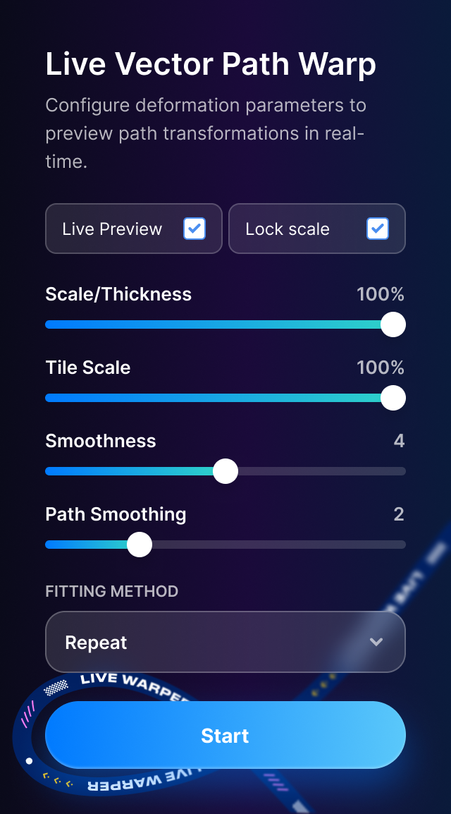

# Figma Live Vector Path Warp


An open-source Figma plugin that deforms vector artwork along a Bezier path instead of placing rigid copies along a line.

The plugin is designed for pattern-brush-like workflows: a source layer is flattened to editable vector geometry, mapped to a target path by arc length, and previewed directly on the Figma canvas.

> Independent project. Not affiliated with Figma or Anthropic.

## Features

- Arc-length parameterization for cubic Bezier paths.
- Repeat and Stretch to Fit modes.
- Live preview while editing the selected path.
- Source support for vectors, frames, groups, components, and instances that can be flattened by Figma.
- Stroke-to-vector conversion with Figma's native `outlineStroke()` API before deformation.
- Geometry subdivision and separate path-smoothing controls.
- Scale/thickness and tile-scale ratio lock.
- Snapshot behavior for previous results when a result is moved, renamed, copied, or replaced through Start.
- No network requests or API keys. The plugin manifest uses `networkAccess: { "allowedDomains": ["none"] }`.

## Interface

The plugin provides live canvas preview, repeat and stretch fitting, thickness and tile-scale controls, path smoothing, and a lock for preserving the source pattern ratio.



## Install in Figma

1. Download or clone this repository.
2. Open Figma and choose `Plugins > Development > Import plugin from manifest...`.
3. Select `manifest.json` from this repository.
4. Run `Plugins > Development > Path Warping Live Vector Preview`.
5. Select one source layer and one vector path, then press `Start`.

The committed `dist/` directory is included so the plugin can be imported without installing Node.js.

## Development

Requirements: Node.js 18 or newer.

```bash
npm install
npm run typecheck
npm run build
```

During development, import the repository's `manifest.json` into Figma. After changing source files, run `npm run build` and reload the development plugin in Figma.

## Architecture

- `src/main.ts` contains selection tracking, live-preview lifecycle, Bezier sampling, arc-length lookup, source flattening, stroke outlining, network subdivision, deformation, repeat tiling, and output-frame management.
- `src/ui.html` contains the standalone webview markup and styling.
- `src/ui.ts` sends settings to the plugin backend and exposes selection/render status.
- `scripts/build.mjs` bundles the backend and UI and embeds the local preview asset into `dist/ui.html`.
- `manifest.json` points Figma to the committed `dist/main.js` and `dist/ui.html`.

## Current limitations

- Figma `PATTERN` paint types are filtered because the Vector Network API rejects them in this workflow. Solid, gradient, image, video, and supported shader paints can be retained where Figma accepts them.
- A single vector layer cannot express z-order inside one self-intersecting fill. Strong self-overlap inside one tile can therefore require a future path-chunking mode.
- Very dense or complex sources can produce many vector regions and may require reducing geometry smoothness for performance.

## Contributing

Bug reports and focused pull requests are welcome. Please include the source type, target path type, fitting mode, relevant slider values, and a minimal reproduction when reporting geometry issues.

Run `npm run typecheck` and `npm run build` before opening a pull request. See [CONTRIBUTING.md](CONTRIBUTING.md).

## License

MIT. See [LICENSE](LICENSE).
